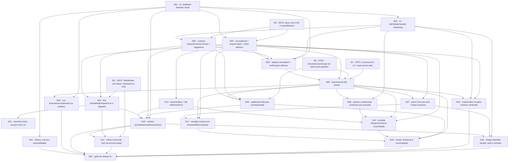

# Whilo — consolidação da auditoria S+ e grafo de implementação

**Data de consolidação:** 3 de outubro de 2026  
**Base:** os 12 resultados estruturados das auditorias S+ fornecidos para execução; relatórios detalhados associados em `docs/audit-splus-01-execution.md` até `docs/audit-splus-12-provenance.md`.  
**Escopo:** produto, execução de agentes/tools, segurança, identidade/tenancy, computador/browser, threads/coordenação, memória/rotinas, experiência visual, voz, comércio, dados, plataforma e proveniência.  
**Natureza:** revisão arquitetural estática consolidada. Esta entrega **não implementa** os controles recomendados, não altera código de produção e não equivale a uma nova execução de CI ou teste live.

> **Decisão executiva — NO-GO para declarar ou lançar “S+” hoje.** Há um produto single-owner utilizável, chat AG-UI real, tasks duráveis e alguns bons padrões de aprovação/receipt. Não há, porém, enforcement central de toda ação externa; há caminhos concretos de side effect duplicável, uma escalada ampla de autorização CUA, identidade multiusuário ausente, integração OpenBot não conectada, capabilities anunciadas que não fecham ponta a ponta e bloqueios de typecheck/test reportados. **Manter o produto em escopo pessoal/single-owner, desabilitar ou restringir os caminhos de maior risco e fechar os gates S+ antes de compartilhamento multiusuário, automação financeira ou alegações de execução exatamente-uma-vez.**

## 1. Convenções para distinguir evidência e plano

- **[FATO OBSERVADO]**: achado atribuído à inspeção dos arquivos/testes/docs nos relatórios. É uma afirmação sobre o snapshot auditado, não necessariamente sobre um checkout posterior.
- **[RECOMENDAÇÃO]**: mudança necessária ou caminho preferencial; não significa que esteja implementado.
- **[HIPÓTESE / DECISÃO PENDENTE]**: escolha de produto, fornecedor ou contrato ainda não comprovada no repositório.
- Referências `[R1]`–`[R12]` apontam para os relatórios locais de auditoria. Referências oficiais numeradas `[1]`–`[25]` ficam ao final.

Os achados abaixo devem ser tratados como baseline de auditoria. Alguns relatórios declaram o commit `9aa69c3`; a auditoria de proveniência inclui observações de branches/submodules em 3/10/2026. Antes de executar um plano, confirme novamente HEAD, configuração implantada e resultados da CI. Onde um relatório diz “não encontrado”, isso significa não encontrado no escopo revisto — não prova universal de inexistência fora dele.

## 2. Decisão de produto e nomenclatura: Whilo, não “Whilow”

### Decisão

**[RECOMENDAÇÃO] Nome canônico para produto, interface, documentação e comunicação: _Whilo_.** Não criar “Whilow” como segundo nome, marca, edição ou linha de produto.

**[FATO OBSERVADO]** A documentação de direção de marca declara “Whilo” como nome instalável e define a orca/baleia-orca como identidade; `docs/OPENDOTS-WHILO.md` orienta preservar essa marca. A busca textual feita na consolidação encontrou muitos usos de `Whilo` e `O1`, e não encontrou “Whilow” nos documentos-chave pesquisados (`README.md`, `docs/OPENDOTS-WHILO.md`, `docs/EXPERIENCE.md`, `docs/OPENBOT-BASE.md` e `docs/OPENBOT-INTEGRATION.md`). O `README.md` ainda descreve O1 em várias passagens e manda clonar `CopilotKit/O1`; o arquivo de experiência ainda tem linguagem OpenMuse/capivara. [R7] [R12]

### Política de nomes

1. **Whilo**: nome público do produto e da experiência do usuário.
2. **O1**: identificador histórico/técnico presente em API, variáveis de ambiente, diretórios e linhagem do repositório. Manter compatibilidade durante migração; não fazer rename em massa de contratos ou segredos sem versão, aliases e plano de sunset.
3. **OpenMuse, OpenBot e OpenDots**: projetos upstream/referências, nunca nomes intercambiáveis do produto Whilo. OpenMuse é ancestral/fork de código; OpenBot é submodule/seam de integração desativado; OpenDots é referência arquitetural/de produto conforme os achados. [R12]
4. **Whilow**: tratar como typo até existir uma decisão de marca documentada pelo owner. Corrigir usos caso sejam encontrados; não usá-lo em UI, package metadata ou releases.

**[HIPÓTESE / DECISÃO PENDENTE]** Confirmar com o owner da marca a forma jurídica/comercial do nome e registrar regra de transição de “O1” nos documentos públicos. Essa confirmação não altera a decisão operacional de usar Whilo na documentação desta auditoria.

## 3. Síntese da auditoria em uma página

### O que já é uma base real

- **[FATO OBSERVADO]** O caminho de conversa integra AG-UI; `/api/copilotkit/*` transmite eventos do runtime e tools do agente executam no servidor. O chat limita-se a seis steps; a execução delegada usa loop limitado, tools serializadas, leases/heartbeat/checkpoints e retomada. O cliente só fornece `open_workspace` como tool externa permitida no caminho citado. [R1]
- **[FATO OBSERVADO]** Há padrões locais mais robustos que devem ser generalizados: `ActionService` com hash, claim e recuperação conservadora para certas ações Gmail; receipts de shell/computer com chave estável e `insertIfAbsent`; armazenamento com `compareAndSwap` e `insertIfAbsent` disponíveis. Isso **não** é uma garantia universal de exatamente-uma-vez. [R1] [R10]
- **[FATO OBSERVADO]** Sessões bearer são aleatórias, armazenadas como digest e associadas a `owner` resolvido no servidor; consultas de Store são particionadas por owner. Isso é uma base de instalação pessoal, não identidade/membership/RBAC multi-tenant. [R3] [R10]
- **[FATO OBSERVADO]** Docker local do computador tem controles úteis: sem rede/host mounts/socket/secrets no container descrito, workspace controlado, limites de tempo/saída e helpers de arquivo com defesa contra traversal/symlink. O browser worker limita destinos públicos e aplica validação de DNS/subrequests. Isso não converte Docker em VM multi-tenant hostil nem prova segurança de um gateway CUA remoto. [R4]
- **[FATO OBSERVADO]** Threads ricas via Intelligence, persistência de tarefas e alguns monitores existem. Isso não fecha relações navegáveis entre thread, mensagem de origem, mission, task, projeto, agente e artifact; handoff aceito não é dispatch concluído. [R5] [R6]

### O que impede o selo S+

1. **Autorização de alto risco:** a rota CUA pode retomar com `approve_for_me` e manter autoridade no loop, em vez de grant one-shot por chamada; o helper `action-barrier` não intercepta o dispatch principal. [R2]
2. **Duplicação de efeitos:** browser e aprovação de connector usam leitura seguida de gravação não atômica; corridas podem despachar duas vezes. Propostas de connector não têm chave estável de invocation e provider idempotency/reconciliação é incompleta. [R1] [R2] [R9]
3. **Identidade compartilhada:** não há `users`, `tenants`, memberships ou RBAC; owner é rótulo derivado de chave. Tokens de connectors são deployment-wide. Não habilitar workspace multiusuário com essa base. [R3]
4. **Execução e claims desconectados:** tool-catalog é discovery estático, não registry executável; capabilities/mission/policy declaradas não provam enforcement no loop. [R1] [R5] [R6]
5. **Computador/takeover incompleto:** console humano não cria exclusividade/lease nem pausa/refusa as ações do agente; adapter OpenBot é disabled/incompatível com requestId em take/release e sem round trip live. [R4] [R12]
6. **Confiabilidade de release:** auditoria de memória reportou `pnpm typecheck` com 63 erros em 46 arquivos, imports inválidos e testes focados bloqueados por incompatibilidade do harness/Node. Esse resultado deve ser revalidado no checkout atual, mas é gate até ficar verde. [R6]
7. **Capacidades de produto incompletas:** recorrência de rotinas, voz realtime, Spaces/Pages, pagamentos confirmados, booking, webhook e platform/release HA não estão entregues de ponta a ponta no escopo observado. [R5]–[R11]

### Política imediata de produto

- **[RECOMENDAÇÃO]** Até fechar P0: manter single-owner; não compartilhar bearer/chave de owner; não habilitar adapter OpenBot em produção; evitar `approve_for_me` em CUA, pagamento, reserva, checkout ou escrita de alto impacto; classificar resultado externo incerto como `outcome_unknown` e bloquear retry automático.
- **[RECOMENDAÇÃO]** Descrever travel como pesquisa/link-out; purchase como handoff manual; Stripe como criação de sessão de cobrança merchant, não pagamento de compra do usuário; voice como ditado web + resposta TTS local, não chamada full-duplex. Remover/ajustar capabilities e copy que afirmem o contrário.
- **[HIPÓTESE / DECISÃO PENDENTE]** Se o produto deve ser primariamente pessoal ou compartilhado/equipe. A recomendação deste documento é **não expandir para multi-tenant até identidade, isolamento de dados e grants executáveis estarem demonstrados**.

## 4. Matriz do que absorver de OpenBot, OpenMuse e OpenDots

| Origem | Absorver/adaptar para Whilo | Não copiar / ressalva | Estado no Whilo auditado |
|---|---|---|---|
| **OpenBot** | Separação entre agent loop AG-UI e gateway server-side de ações; resolver actor/alvo no servidor; grants/policy deny-first; registrar decisão antes do dispatch; sessões e ACLs por recurso; controle humano exclusivo com requestId, drain e handback; disciplina de evidência/estado; deploy de serviços persistentes separado do frontend. [1] [5] [6] [7] | Não copiar default permissivo dos exemplos. Não tratar OpenBot como SaaS multi-tenant pronto, pacote de runtime ou integração funcional do Whilo. Não mandar sessão/admin token compartilhado. Intelligence não é endpoint AG-UI SSE genérico. Computador/OpenBot não é isolamento real sem supervisor/configuração. [R1] [R3] [R4] [R12] | Adapter HTTP existe desabilitado e com fixtures; não foi encontrado call path live. Há divergência gitlink/contrato/docs; take/release omitem `requestId` que upstream requer. Submodule URL aponta para fork, embora o gitlink auditado estivesse em SHA upstream verificável. [R4] [R12] |
| **OpenMuse** | Manter conversa como superfície principal; AG-UI, tools explícitas de servidor, resultados ricos inline, input persistente; worker durável com lease/checkpoint; incerteza honesta; não repetir automaticamente write externa de resultado desconhecido; evolução do fork em merges pequenos revisados; PWA/mobile pessoal como referência. [2] [8] | Não confundir ancestralidade com integração. Não importar identidade visual OpenMuse/capivara para Whilo. Não fazer rebase/merge em lote da história divergida. Não copiar seu modelo single-owner compartilhado como se fosse multi-tenant. | A comparação mais próxima ao motor de chat e worker; Whilo é fork com deriva substancial; documento `EXPERIENCE.md` mantém instruções visuais OpenMuse/capivara conflitantes com Whilo. [R1] [R3] [R7] [R12] |
| **OpenDots** | Verificação/revogação de grants durante execução longa; escopo de tools por agente/Dot; clareza entre agentes especialistas, biblioteca/artefatos e revisão antes de salvar; pages/workspaces como referência de fluxo, não como cópia de estado. [3] [9] | Não copiar mascotes/paleta/sidenav como identidade Whilo. Não declarar `toolScopes` efetivos antes de aplicá-los server-side. OpenDots é single-owner no material auditado e não oferece prova de isolamento SaaS. Seu audit de computador não garante idempotência. | Nenhuma dependência/código incorporado foi encontrado nos manifests/apps/packages/tests; uso observado é documental. [R1] [R3] [R7] [R12] |

**Regra de absorção:** adotar contratos e mecanismos comprováveis, não slogans/capability flags. Qualquer cópia de código/asset precisa de revisão file-by-file, SHA, licença, copyright, alteração registrada e notice correspondente. Manter OpenBot como serviço separado até contrato live e identidade delegada serem demonstrados.

## 5. Inventário de capacidades concretas (estado observado)

Legenda: **E** existente e conectado no escopo citado; **P** parcial/fragmentado; **A** ausente ou não conectado; **D** não comprova deployment. O estado não afirma readiness S+.

| # | Capacidade concreta | Estado observado | Limite material / consequência |
|---:|---|---|---|
| 1 | Conversa AG-UI no runtime do servidor | **E** | Endpoint `/api/copilotkit/*`, loop de tools server-side e limites de steps; AG-UI entrega eventos, não receipts/idempotência. [R1] |
| 2 | Tools de servidor validadas | **E/P** | Há validação e tool arrays no chat/worker, mas construções e dispatch são listas distintas; policy central não cobre todas. [R1] |
| 3 | Discovery/catalog de tools | **P** | Catálogo O1 é estático; divergências `travel_planning` vs `travel_search`, `payments` sem executor homônimo, tools ativas ausentes; discovery não autoriza nem remove tools. [R1] |
| 4 | Policy gateway / ActionKernel único | **A** | `authorizeTool` e `action-barrier` existem como primitives/endpoints, não interceptam o dispatch principal; aplicação de policy espalhada. [R1] [R2] |
| 5 | Tasks delegadas duráveis | **E/P** | Lease, heartbeat, checkpoint, CAS e retomada existem. Isso não dá exactly-once a efeitos externos executados antes de persistir checkpoint. [R1] [R10] |
| 6 | Aprovação e envio de email | **E/P** | `ActionService` protege certos envios com hash/claim/expiração; ID do provider prova envio, não entrega. Esse nível não está generalizado. [R1] [R9] |
| 7 | Aprovação de ConnectorAction | **P / risco alto** | `get`→`put(executing)` permite corrida; proposal UUID aleatória, recovery incompleta, token global por processo. [R1] [R2] [R9] |
| 8 | Browser actions e receipts | **P / risco alto** | Receipt existe, porém `get`→`put` não é claim atômico; erro incerto pode virar failed/retry; teste cobre replay sequencial, não concorrência. [R1] [R4] |
| 9 | Computador local Docker / shell | **E/P** | Isolamento local útil, bounded shell, workspace e receipts de comando; não é desktop gráfico nem VM hostil/tenant-isolated. [R4] |
| 10 | Mutação de files/PDF | **P** | Algumas ferramentas de escrita/import/export não possuem `operationId`/receipt comum; side effect e artefacto podem duplicar. [R1] [R10] |
| 11 | Computer fabric / provider remoto | **D/P** | Provider Hetzner cria servidor, mas bootstrap runtime/daemon e ligação ao gateway genérico não foram demonstrados. Gateway CUA requer certificação de egress. [R4] |
| 12 | Human browser takeover | **A/P** | Browser console manda input sem lease/control state, não pausa/refusa agente nem passa pelo mesmo audit/action service. [R4] |
| 13 | Agent registry e tool scopes | **P** | Registry persiste perfil/scope, mas não é roster/authorization conectado ao runtime. `toolScopes` não são grants efetivos. [R3] [R5] |
| 14 | Sessão e isolamento por owner | **P** | Bearer digest e owner scoping existem; owner não é user/tenant com membership; Store JSONB sem FK/RLS. [R3] [R10] |
| 15 | Multiusuário/tenant/RBAC | **A** | Não há users, tenants, memberships ou RBAC de produto; não habilitar workspace compartilhado. [R3] |
| 16 | Rich threads e replay | **E/P** | Hooks e threadId estável no fluxo principal; side chat/fila possuem estado volátil e `/api/main-thread` reporta `existing:true` mesmo no fluxo examinado. [R5] |
| 17 | Relações thread→task→mission→artifact | **A/P** | AgentTask não mantém FKs/referências navegáveis às fontes/entidades citadas; idempotência pode depender de hash difícil de reconstruir. [R5] |
| 18 | Missions, DAG e handoffs | **P/A** | Mission store/task graph não governam o worker; handoff aceito só muda status, sem dispatch real; validação/CAS insuficientes. [R5] [R6] |
| 19 | Memória e retrieval | **P** | Duas stores; UI expõe uma; O1 memory não tem UI/grants/orçamento; `project` sem projectId real. Retrieval lexical local existe. [R6] |
| 20 | Monitores/background/proatividade | **P** | Monitor durável e sugestões periódicas existem; alguns refreshes leem Gmail/Calendar; “ocultar cartão” não pausa atividade; faltam caps/controles claros. [R6] |
| 21 | Rotinas recorrentes | **A/P** | Scheduler exige `nextRunAt`, mas criação não gera próxima ocorrência/cron recorrente; trigger webhook sem ingress e dedupe confiáveis. [R6] [R11] |
| 22 | Viagem | **E (link-out)** | Constrói links a provedores; não consulta fare/availability nem reserva. Copy de “checkout”/ranking ultrapassa o executor disponível. [R9] |
| 23 | Compra/purchase | **E (handoff manual)** | Card abre URL HTTPS e instrui usuário; sem snapshot de checkout, detecção de preço, pedido ou recibo verificado. [R9] |
| 24 | Stripe/payment | **P** | Cria sessão Stripe de cobrança merchant; não confirma pagamento, não executa compra como consumidor, recipient não é enviado, webhook/refund/OAuth callback não estão entregues. [R9] |
| 25 | Voz | **E (ditado web/TTS local)** | Web Speech → texto enfileirado → agente → resposta completa por TTS; sem WebRTC full duplex/VAD/barge-in; hang-up não prova cancelamento do run. [R8] |
| 26 | Design system/PWA | **P** | Primitives/paleta/PWA existem; assets logo/avatar se confundem, docs conflitantes, tokens semânticos/estados/contraste e ícones maskable não validados. [R7] |
| 27 | Store e event model | **P** | Store PGlite/PostgreSQL usa tabela genérica JSONB; CAS/leases ajudam, mas não há migrations versionadas, event cursor/sequence/outbox transacional e artefactos/PDF separados. [R10] |
| 28 | Runtime/release/observabilidade | **D/P** | API pode iniciar worker/scheduler no mesmo processo; Vercel config observada só serve export estático; não foi provado deployment HA, backup/restore, readiness, SLO ou release backend. [R11] |
| 29 | Proveniência upstream/licenças | **P** | MIT presente; pin URL/doc/contract desalinhados, sem ledger/notices consolidados/SBOM gate. [R12] |

## 6. Achados priorizados com arquivo e mecanismo

### P0 — bloquear risco imediato / afirmar o baseline

| ID | Achado e mecanismo observado | Caminho de correção | Gate / teste de aceite |
|---|---|---|---|
| **P0-1 Build/test não confiável** | Auditoria de memória reportou `pnpm typecheck` com **63 erros em 46 arquivos**, incluindo imports inválidos em `apps/server/src/o1/routines.ts` e módulos relacionados; testes focados falharam por imports e uso de `expect` incompatível com Node 22.13.0. [R6] | Consertar imports/harness; fixar versão Node/pnpm no CI; gerar baseline reproduzível antes de refatorar. Revalidar no checkout atual: relatório não substitui CI nova. | CI limpa: typecheck, lint, build e testes unitários verdes no Node fixado; registro do SHA e logs. Teste: clone limpo, `pnpm install --frozen-lockfile`, scripts oficiais e suíte focada de rotinas/recovery. |
| **P0-2 Grant CUA amplo** | `apps/server/src/app.ts:227-257` retoma CUA com `approve_for_me`/`approvalGranted=true`; `apps/server/src/o1/openai-computer-runner.ts:43-75` mantém autoridade no loop. Uma confirmação pode cobrir chamadas posteriores. [R2] | Substituir por autorização one-shot contendo `ownerId`, `runId`, `toolCallId`, `actionHash`, alvo, escopo, expiração e estado claimed; exigir revisão para cada nova mutação; `approve_for_me` jamais deve significar CUA irrestrito. | Testes: grant de chamada A não permite B; hash/alvo alterado recusa; expiração e revogação recusam; concorrência só permite um claim; restart resulta em interrupted/outcome_unknown, não aprovação implícita. |
| **P0-3 Writes duplicáveis em concorrência** | `apps/server/src/o1/browser-actions.ts:27-49` e `connector-actions.ts:34-52,95-130` usam padrões get/put ou propostas UUID distintas, sem claim atômico suficiente; connector não envia idempotency key comum ao provider. [R1] [R2] [R9] | Gerar `invocationId` estável por run/tool call; claim via CAS/`insertIfAbsent` **antes** do dispatch; rejeitar fingerprint divergente; passar provider idempotency key quando suportada; resposta incerta bloqueia retry e aciona reconciliação. | Testes concorrentes (N chamadas iguais → 1 dispatch); mesma key/payload diferente → 409/recusa; crash antes/depois do dispatch; timeout pós-dispatch; replay de `outcome_unknown`; PGlite e PostgreSQL com semântica equivalente. |
| **P0-4 Autoridade/policy fragmentada** | `apps/server/src/o1/action-barrier.ts` é primitive não conectado; `authorizeTool` não intercepta dispatch principal; controles variam entre `browser_input`, connectors, computer e `ActionService`. Tool discovery/prompt/capability flags não autorizam. [R1] [R2] | Não abrir novos writes até ter wrapper server-side fail-closed (ActionKernel) em todos os side effects existentes. No curto prazo, desabilitar ou restringir caminho sem enforcement; check actor, recurso, schema, grant, alvo e permission mode no dispatch. | Matriz negativa por cada ferramenta de escrita: sem grant, owner errado, schema inválido, alvo alterado, grant expirado/revogado e policy indisponível → zero provider dispatch e evento de recusa. |
| **P0-5 Chaves/login frágeis e workspace compartilhado** | `apps/server/src/config.ts:105-115,153-160`: live valida que alguma chave tenha 24+ caracteres; chave fraca em outro item ainda pode ser aceita. Rate limit de login em `app.ts:158-166` é in-memory/processo. Um bearer de `local-user` compartilhado funde dados/autoridade. [R3] | Validar individualmente toda credencial, rejeitar owner/key vazios/duplicados/fracos, rotacionar credenciais potencialmente expostas, rate limit distribuído. Manter instalação single-owner; proibir chave de owner compartilhada entre pessoas. | Testes config: arrays mistos forte/fraca, duplicadas e vazias falham; rate limit compartilhado entre réplicas; smoke de auth confirma owner derivado apenas da sessão. Critério produto: aviso/documento de single-owner até P1 tenancy. |
| **P0-6 Claims de capability/status incompatíveis** | Catálogo O1 é discovery estático e nomes não correspondem às tools; capabilities anunciam policy/missions/realtime voice sem wiring completo. `README.md`/docs ora falam de OpenBot como base, ora admitem integração futura. [R1] [R6] [R8] [R12] | Fazer inventário de copy, endpoints e capability flags; afirmar apenas caminho demonstrado. Corrigir travel/purchase/payment/voice e OpenBot; esconder/desativar flags sem executor. | Teste de contrato/CI que cada capability anunciada tem executor, permission test, receipt/telemetria e jornada mínima; snapshot/copy review. Falha de registry → não anuncia tool executável. |
| **P0-7 Proveniência e contrato OpenBot contraditórios** | `.gitmodules` aponta para fork `ryantheirreal/OpenBot`; gitlink observado em `cb5dc32…`, docs citam `afe6233…`, adapter cita `a96d88c…`; contrato take/release não persiste/envia `requestId` exigido pela revisão fixada. [R4] [R12] | Canonizar URL oficial, escolher uma revisão fixa, registrar SHA único e separar pin de contrato vs histórico. Não ligar adapter a produção; corrigir requestId e só habilitar após teste live no mesmo SHA. | Clone limpo inicializa submodule; CI confere ledger↔gitlink↔constante; contract test inclui requestId obrigatório e servidor da revisão exata; produção permanece disabled até identidade/ACL e round trip live. |

### P1 — fundações de arquitetura/produção

| ID | Achado e mecanismo observado | Intervenção | Critério verificável |
|---|---|---|---|
| **P1-1 Identidade, tenancy e grants** | Sem users/tenants/memberships/RBAC; Store owner JSONB sem FK/RLS; agent scopes e PermissionMode não equivalem a acesso. Tokens de connectors globais; remote agent usa token estático. [R3] | OIDC/IdP com `(issuer, subject)` imutável; `tenantId/userId/actorId` tipados; membership e roles; constraints/FKs e RLS onde aplicável; grants de agente/Bot; token exchange/assertion curta aud/exp/scopes para bridge. Separar quem pode agir de quando exigir aprovação. | Testes cross-tenant em API, tool, arquivo, browser, worker, scheduler e adapter; token de tenant A nunca lê/escreve B; revoke em execução é observado no próximo checkpoint/tool dispatch; sessão revogada deixa de funcionar. |
| **P1-2 Registry canônico + ActionKernel + ledger correlacionado** | Tool arrays fragmentadas; audit ledger parcial sem ciclo invocation/decision/dispatch/result; redação por nome de chave é insuficiente para todos payloads. [R1] [R2] | Um registry executável gera schema, discovery e docs; dispatcher único atribui invocationId e aplica grant, policy, budget, approval, claim, receipt, audit e dispatch; audit versionado e redigido por schema com identidade/iniciador/alvo/hash/status/timestamps. | Contract test cobre 100% das tools que produzem side effect; toolId/schema/executor únicos; eventos correlacionam `runId/threadId/taskId/toolCallId/invocationId`; payload sensível é redigido; decisão aparece antes de dispatch. |
| **P1-3 Receipt e recuperação comuns** | Receipts parciais; writes de file/PDF sem operationId; actions executing podem ser globalmente marcadas unknown no boot sem lease/idade em outras réplicas; run órfão pode permanecer running. [R1] [R10] | State machine `proposed→awaiting_review→claimed→executing→succeeded|failed_pre_dispatch|outcome_unknown|reconciled`; lease/fencing token; event sequence/cursor; recuperação só de lease expirado; fingerprint payload; operação de reconciliação explícita. | Teste kill/restart em cada transição; nenhuma ação em execução viva é tomada como interrompida por outra réplica; crash pós-efeito vira unknown até reconciliação; event replay idempotente. |
| **P1-4 Computer/takeover real** | Console humano e agente compartilham browser sem lease de controle; não há pause/refuse/drain/handback audit completo; provider/fabric incompleto. [R4] | Máquina durable request→take(requestId)→exclusive human lease→input audited→release→fresh snapshot→resume; toda mutação bot (browser, shell, write) é recusada durante lease; timeout/restart vira interrupted. Escopo por owner/agent/computer é decisão explícita. | Matriz simultânea humano vs bot em click/navigate/type/shell/file-write; lease expira/revogação; stale snapshot impede resume; duas requisições têm um winner; logs não contêm tokens. |
| **P1-5 IDs, threads, tasks, mission/handoff** | Task sem referências navegáveis de origem; `existing` incorreto no main-thread; handoff sem dispatch; planner/task-graph não integrado; referências não validadas por owner. [R5] | Contrato tipado de `ownerId/threadId/sourceMessageId/missionId/projectId/spaceId/agentId/runId/taskId/channelId`; validar referência no owner; persistir vínculo no task create; integrar dispatch de handoff e DAG com CAS e packet restrito. | Criar conversa, delegar, reiniciar, retomar e navegar até fonte/resultado; evento duplicado não duplica task; cross-owner ID retorna 404/deny; handoff aceito só aparece como concluído após execução/resultado. |
| **P1-6 Memória e rotinas** | Duas stores; scope project fictício; injeção integral de memória antiga em tarefa; rotina recorrente sem cálculo de próxima ocorrência/lease por ocorrência; triggers/dedupe fracos. [R6] | Unificar memória com scopeId real, origem, grants, lifecycle e UI de revisão; orçamento top-k/tokens. Rotinas: cron validado, timezone/DST, `nextRunAt`, `RoutineRun` com occurrenceKey e lease/CAS, pause/quiet hours/caps/health. | Migração com contagem/hash; testes de permission/scope/revoke/retrieval budget; calendário com DST, missed run, duplicate event, retry limitado e stop/pause; aceitar sugestão não equivale a execução recorrente. |
| **P1-7 Persistência/event model/artefatos** | `Store` é records(owner,kind,id,data JSONB), schema inline; sem migrations versionadas, FK, RLS; `RunEvent` sem sequência/cursor; writes de event/checkpoint/run separados; PDFs em filesystem e metadata no Store. [R10] | Expand/contract: tabelas tipadas para tasks/runs/events/actions/artifacts/idempotency; `request_hash` + unique owner/op/key; transaction boundary no Store; banco como source of truth; objeto privado por owner/checksum para arquivos; outbox. Não migrar para Supabase só porque docs mencionam. | Migração shadow-read, igualdade de contagens/checksums, recuperação completa; chave mesma payload devolve resultado e diferente recusa; rollback testado; testes RLS/Auth hosted antes de alegar isolamento Supabase. |
| **P1-8 Commerce/webhooks** | Travel só link-out; purchase só handoff; Stripe cria sessão merchant, sem payment confirmation, webhook/refund; `recipient` não enviado; global approve mode pode habilitar browser write. [R2] [R9] | Escopo inicial honesto; bloquear submit semanticamente sem revisão pontual, host/total/merchant vinculados; para cobrar via Stripe, implementação futura de webhook assinado, event dedupe, account scoping e reconciliação; não construir refund/booking sem estado original e provider idempotency. | E2E em modo teste: aprovação revisa valor/merchant/moeda/conta, alteração exige reaprovação, webhook assinado e duplicado não duplica; payment session created não é rotulada paid; compra/booking continuam off até API autorizada. |
| **P1-9 Plataforma e release** | Vercel export estático; API/worker/browser persistentes não provados por config observada; health só “ok” do processo; webhook público/outbox, backups, SLO, readiness e rollback backend ausentes/parciais. [R11] | Desenhar runtime Node always-on, PostgreSQL gerenciado/PITR, artifacts duráveis, browser privado; readiness DB+Chromium; build imutável por digest, staging/smoke/approval/rollback; webhooks com raw-body signature, replay window, inbox/outbox, DLQ/replay e consumer idempotente. | Simular indisponibilidade/restart, restore com RPO/RTO acordados, queue retry/DLQ/replay, deploy e rollback; readiness falha quando dependência crítica falha; 2xx webhook somente após persistência. |

### P2 — completude e qualidade com escopo seguro

| ID | Arquivo/eixo | Trabalho recomendado e aceite |
|---|---|---|
| **P2-1 Voz e multimodalidade** | `apps/mobile/src/voice-call.tsx`, `chat.tsx`, `conversation-queue.ts`, `apps/server/src/o1/capabilities.ts` [R8] | No curto prazo, renomear para ditado web, bloquear UI nativa não suportada, tornar transcript editável/revisável, expor backlog/erro e cancelar run de forma explícita. Se produto escolher realtime: WebRTC autenticado, segredo normal só no servidor/client secret efêmero, VAD/cancel/clear/truncation, delegação estreita ao agente AG-UI e consentimento. Testes browser/device/network/noise/interrupt/tool-running. |
| **P2-2 Design system/brand/accessibility** | `apps/mobile/src/ui.tsx`, `screens.tsx`, `chat.tsx`, cards, `apps/mobile/assets/*`, manifesto e `docs/EXPERIENCE.md` [R7] | Separar `WhiloWordmark`, `WhiloAppIcon`, `WhiloAvatar`; não apagar capivara até auditar consumers; tokens semânticos para status/foco/superfícies; estados por texto/ícone além de cor; corrigir placeholder baixo contraste e validar maskable safe zone. Testes axe/contraste e matriz 360–1280 px, keyboard/VoiceOver/TalkBack/NVDA/reduced motion. |
| **P2-3 Proatividade/custos** | `apps/server/src/engine/service.ts`, `workspace.ts`, UI de background updates [R6] | Preferência explícita por fonte, frequência, quiet hours, pausa global, quota/custo e saúde; distinguir sugestão, notificação e atualização chat. Métricas agregadas de polling/provider; teste de consentimento e pausa que prove nenhuma leitura/notificação adicional. |
| **P2-4 Evolução upstream/compliance contínua** | `.gitmodules`, `docs/OPENBOT-*`, `LICENSE`, CI [R12] | `docs/UPSTREAMS.md`, `THIRD_PARTY_NOTICES.md` e SBOM; CI inicializa submodules e compara SHA/URL/notices; atualização OpenMuse em PRs menores sem rebase/merge cego. Teste clone limpo e gate de notice/licença. |
| **P2-5 Operação e experiência** | `apps/mobile/src/*`, observabilidade/runbooks [R7] [R11] | Timeline/receipts acessíveis, readiness/health de dependências, métricas p50/p95, cancelamento e estados de erro claros; medir antes de otimizar. Testes visuais e de telemetria com PII redigida. |

## 7. Mapa da arquitetura-alvo

**[RECOMENDAÇÃO]** Separar fonte de conversa, controle de acesso, execução de side effects e persistência. Um serviço ou capability existe apenas quando o caminho está ligado, autorizado, auditado e testado.

| Camada | Responsabilidade-alvo | Contrato / limites |
|---|---|---|
| **1. Cliente Whilo (web/mobile)** | Composer, threads, review cards, task/artifact status, controls de pause/cancel, takeover e preferências. | Cliente solicita; não decide owner/tenant, scope, grant, aprovação efetiva ou status de pagamento. Transcripts/artefatos são referenciados por IDs, não duplicados como estado autoritativo. |
| **2. Identity & session** | Resolver principal autenticado; sessão revogável; `tenantId/userId/actorId`; role e memberships. | Claim do cliente não é autoridade sem assinatura/validação; default-deny; modo single-owner preservado até migração comprovada. |
| **3. API/control plane Whilo** | Rotas de threads/tasks, O1AgentRegistry, projetos/Spaces quando existentes, connector/account, approvals e audit query. | Schema Zod/versionado, valida referência por owner/tenant; `PermissionMode` (necessidade de revisão) separado de RBAC/grants (quem pode agir). |
| **4. Agent orchestration** | AG-UI interactive run e worker durable task; resolver thread/message/mission/run; limite de steps, budget e cancel. | Prompt e catalog são discovery; tools são definidas no servidor; agent não recebe autoridade fora da policy. TaskWorker mantém lease/checkpoint e não promete exactly-once externo. |
| **5. ActionKernel / gateway** | Única fronteira de qualquer write: identity→tool schema→target→grant/policy→approval→atomic claim→audit decision→dispatch→receipt/reconcile. | Fail-closed; `invocationId`, `runId`, `threadId`, `taskId`, `toolCallId`; request hash, alvo e snapshot vinculados; `outcome_unknown` bloqueia retry cego. |
| **6. Domain executors** | Email/connectors, browser, computer/files, commerce e eventualmente voice delegation. | Providers isolados; credential por owner/tenant quando aplicável; egress deny-by-default; idempotency key provider-specific; gateways externos atrás do ActionKernel. |
| **7. Durable state** | PostgreSQL/migrations para identity, grants, tasks/runs/events, actions/receipts, idempotency, routines; object storage privado para artifacts. | JSONB somente payload flexível; unique constraints, FKs compostas, lease/fencing, event sequence/cursor, transações inbox/outbox. PGlite é teste/local, não substituto de hosted Postgres/RLS. |
| **8. Runtime/platform** | API/worker Node persistentes; browser/Chromium isolado e privado; queue de webhook opcional; edge para TLS/WAF/rate-limit; frontend estático separado. | Readiness verifica DB e browser; artifacts imutáveis por digest; secret runtime-only; backup/restore, DLQ, métricas, alertas, runbook e rollback. Serverless não hospeda loop persistente/computer. |
| **9. Observabilidade/revisão** | Lifecycle audit append-oriented, UI de Activity/receipts, health e métricas sem segredo/PII excessiva. | Audit registra initiator, decision, payload hash, destino, timestamps, resultado e reconciliação; destino/retention/integridade definidos. Realtime pode avisar, event log durável continua fonte. |
| **10. Upstreams** | OpenMuse como proveniência/evolução do fork; OpenBot como serviço/contrato opcional; OpenDots como padrão/referência. | Pin único; sem wiring presumido. Bridge OpenBot delega identidade curta com audience/scopes e revalida ACL; não compartilhar sessão administrativa. |

## 8. Grafo Mermaid de nós, dependências e caminhos críticos

Nós `B*` são bases observadas a preservar; `N*` são entregas recomendadas, não implementadas. As setas indicam dependências funcionais principais, não cronograma fechado. O grafo contém **26 nós**.

### Caminhos críticos do grafo

1. **Escrita externa segura:** `N01 → N04 → N09 → N05 → N07/N17 → N18 → N22`. Primeiro tornar os testes confiáveis; gerar identidade estável de invocação; sincronizar registry/schema; interceptar write no ActionKernel; aplicar grant/claim/receipt; expor revisão/reconciliação; só então liberar.
2. **Multiusuário sem confused deputy:** `N01 → N02 → N03 → N09 → N05 → N16 → N22`. Auth/tenant e schema precedem RBAC efetivo, grants de agente e compartilhamento. N16 é um gate, não uma feature que pode ser habilitada por configuração isolada.
3. **Automação durável:** `B2/B3 → N04 → N10 → N19 → N12 → N22`, com N13 se a origem for webhook. Tasks/occurrence keys e claims vêm antes de cron/evento; event log e runtime persistente vêm antes de prometer recuperação operacional.
4. **Computer/takeover:** `N01 → N04 → N05 → N07 → N17 → N18 → N22`; OpenBot é uma dependência adicional por `N07 → N15 → N22` e só entra depois de grant exclusivo, identidade, requestId e round trip validado contra revisão pinada.

**Leitura importante:** N05/N16/N17/N22 são entregas futuras. O desenho mostra dependências, não prova que o código do Whilo já tenha ActionKernel, tenancy, receipts universais ou OpenBot conectado.

## 9. Backlog por tier S+/S/A/B, com ordem, aceite e testes

Os tiers são classes de rigor/valor, não estimativas de calendário. A ordem abaixo respeita dependências; a equipa pode paralelizar apenas trabalho que não enfraqueça gates. Cada item precisa de owner de produto/engenharia antes de entrar em release.

### Tier S+ — bloqueadores de confiança; sem exceção para side effects de alto risco

| Ordem | Entrega | Critérios de aceite | Testes/evidência obrigatórios |
|---:|---|---|---|
| **S+1** | Corrigir baseline de CI e registrar estado do checkout | Typecheck/build/lint/test verdes em clone limpo; fixar runtime; erros conhecidos não ficam ocultos por `skip`/exclusão. | `pnpm install --frozen-lockfile`; typecheck completo; testes de routines/recovery/actions; artifact de CI associado a SHA. |
| **S+2** | Grant CUA one-shot | Grant ligado a actor/owner, run, toolCall, hash de ação/alvo e TTL; claim atômico; novo call exige revisão; revoke funciona. | Teste de sequência A→B, hash alterado, concorrência, TTL, restart, revogação e timeout pós-dispatch. |
| **S+3** | Claim/idempotência para browser e connector | `invocationId` estável, fingerprint de request, estado persistente, CAS/unique antes de dispatch; unknown bloqueia retry; provider key quando suportada. | N chamadas em paralelo resultam em um dispatch; payload conflitante recusado; crash antes/depois do efeito; replay e reconciliação; Postgres+PGlite. |
| **S+4** | ActionKernel deny-first aplicado a toda write | Um único wrapper server-side é caminho obrigatório para email write, connectors, browser/CUA, computer/files, payment e future booking; indisponibilidade de policy recusa. | Matriz de todas as tools com deny-by-default, alvo inválido, schema inválido, permissão revogada e chamada sem contexto; assert de zero invocações de provider. |
| **S+5** | Retirar alegações que excedem execução comprovada | UI/docs/capabilities descrevem somente experiências implementadas; OpenBot adapter disabled; multiusuário e comercio transacional não são vendidos como prontos. | Teste automático de capabilities ↔ executor; checklist de copy/UX; fixture do adapter sem habilitação live. |
| **S+6** | Credenciais de acesso seguras para modo live | Cada entrada de chave é validada; chaves fracas/duplicadas/vazias rejeitadas; rate limit não depende de processo único; rotação documentada. | Casos de configuração adversarial e rate limit distribuído; teste de sessão expirada/revogada; auditoria de secret leakage nos logs. |

**Gate S+:** nenhum P0 aberto; falhas de autorização negam; nenhuma duplicação sob teste concorrente/crash; build verde; nem OpenBot nem CUA/shared workspace habilitados sem contrato correspondente. `outcome_unknown` é estado operacional explícito, nunca sucesso/falha retryable por conveniência.

### Tier S — fundação de segurança, dados e operação

| Ordem | Entrega | Critérios de aceite | Testes/evidência obrigatórios |
|---:|---|---|---|
| **S1** | Principal/tenant, memberships e migração gradual | `(issuer,subject)` imutável; sessões revogáveis; tenant/user/actor tipados; roles/grants separados de approval mode; recurso sempre scoping server-side. | Matriz cross-tenant em rotas/tools/worker/files/scheduler/computer; membership removal/revoke durante run; migração explícita `local-user`. |
| **S2** | Schema/event/receipt versionado | Migration framework; tasks/runs/events/actions/idempotency/artifacts tipados; sequence/cursor, lease/fencing, fingerprint; audit correlacionado. | Backfill + shadow-read com checksum; event replay sem duplicar; duas réplicas e falha de processo; restore/rollback comprovados. |
| **S3** | Registry de tools e grants de agente | Definição executável única gera schema, discovery e documentação; `toolScopes` aplicados pelo servidor; permission watcher em loop longo. | Contract test para cada tool; tentativa de tool fora do scope; revogação durante execução interrompe antes do próximo dispatch; nenhuma autoridade via prompt. |
| **S4** | Receipts e UI de revisão Activity | Cada side effect correlaciona proposta, aprovação, dispatch, resultado/unknown/reconciliação, iniciador e alvo; redaction por schema. | Verificação de audit antes/depois; PII/segredos ausentes; query por invocation/run; usuário vê estados sem confundir created/sent/paid/booked. |
| **S5** | Computer takeover e OpenBot bridge | Exclusividade humana, pause/drain, requestId, handback com snapshot fresco; identidade curta assinada ou OBO; computador isolado por escopo decidido. | Live contract test contra SHA pinado; clique/escrita simultâneos; restart/lease expiry; recusa de ação de bot enquanto humano controla; não compartilhar cookies/secrets. |
| **S6** | Deploy persistente, observabilidade e restore | Topologia API/worker/browser/DB/storage, readiness real, backups e runbook; release por digest e rollback backend. | Testes de readiness, degradação, backup/restore e rollback; metas RPO/RTO definidas e medidas; health inclui DB e Chromium. |

### Tier A — fechar jornadas de produto com escopo seguro

| Ordem | Entrega | Critérios de aceite | Testes/evidência obrigatórios |
|---:|---|---|---|
| **A1** | Threads→tasks→missions→artifacts | Referências tipadas/source IDs, owner validation, dispatch real do handoff e DAG persistente; único estado canônico de execução. | Refresh/replay/restart; duplicate source message; cancel/pause; handoff sem resultado não apresentado como concluído; ID cross-tenant recusado. |
| **A2** | Memória e projetos/Spaces | Uma store; `scopeId` real; grants read/write; origem/revisão/forget UI; retrieval com top-k e budget. | Migração com checksum; isolation por scope; retrieval token cap; deleção/supersession; negar projeto inexistente/sem membership. |
| **A3** | Rotinas e event triggers | Cron/timezone/next occurrence; occurrenceKey/lease; pausa, quiet hours, limites e retries com idempotência; event ingress assinado se ativado. | DST, evento duplicado, janela perdida, múltiplas réplicas, pause/resume e DLQ/replay. |
| **A4** | Commerce delimitado por produto | Manter travel como discovery até ter quote API; purchase só manual; se Stripe merchant checkout for mantido, webhook confirma `payment_status` e não “booking/compra do usuário”. | Sandbox E2E com assinatura, duplicate event, idempotency, amount/currency/account; alteração da cotação invalida approval; refund permanece off até projeto próprio. |
| **A5** | Voz com promessa correta | Ou ditado web revisável/cancelável suportado, ou projeto realtime com consentimento, credenciais seguras e bridge única para AG-UI. | Safari/Chrome/device support, permissão negada, resultados finais, backlog, cancel run, barge-in/latência se declarada. |
| **A6** | Marca e acessibilidade | Whilo assets separados; tokens semânticos; status textual/ícone; copy e locale consistentes; contraste e PWA mask testados. | WCAG contraste/teclado/assistive tech e screenshot matrix; link install/offline/update; nenhum estado apenas por cor. |

### Tier B — qualidade incremental / otimização condicionada a métrica

| Ordem | Entrega | Critérios de aceite | Testes/evidência obrigatórios |
|---:|---|---|---|
| **B1** | Melhorias de UX/telemetria de latência | Métricas p50/p95 para fala/transcript/tool, queue wait, task start e provider outcomes; sem conteúdo sensível. | Redaction tests, dashboard/alert threshold e teste de amostragem/custo. |
| **B2** | Realtime/broadcast como hint | Notificações privadas, event API com cursor como fonte durável; nenhuma dependência de broadcast para recovery. | Reconnect, replay pelo cursor, policy por owner, indisponibilidade do realtime sem perda de estado. |
| **B3** | Otimização de busca/memória | Fazer benchmark antes de embeddings; manter FTS/top-k se satisfaz custo/qualidade. | Dataset de eval versionado, recall/relevance e orçamento; não degradar isolamento nem aumentar coleta sem consentimento. |
| **B4** | Melhorias de browser/computer e escalabilidade | Afinidade de sessão, egress, pool e worker scale baseados em uso medido; sem criar rede de shell irrestrita. | Load/concurrency, egress SSRF/redirect/DNS, profiles isolados, resource exhaustion e incidente simulado. |
| **B5** | Sincronização upstream e artefatos de compliance | PRs pequenos de OpenMuse; pin OpenBot único; notice/SBOM por release; OpenDots só reference enquanto não houver código adotado. | Clone limpo, CI submodule SHA, licença/notices e relatório de delta upstream revisado. |

## 10. Plano de migração sem big bang

### Fase 0 — conter e medir (sem reescrever Store)

- **[RECOMENDAÇÃO]** Manter single-owner; negar acesso compartilhado e registrar claramente a limitação.
- Revalidar a falha de typecheck/imports no HEAD atual; estabelecer CI reproduzível e inventário de tools/side effects.
- Remover claims incorretos e bloquear/desabilitar os caminhos sem aprovação por chamada/recibo. Não habilitar adapter OpenBot nem flows payment/refund/booking.
- Corrigir validação de chave, rotação e rate limit antes de expor modo live com múltiplas réplicas.
- Gerar uma matriz de tool name → schema → executor → policy → provider → receipt → test; não avançar sem lista completa.

### Fase 1 — contrato de invocation e atomicidade aditiva

- Gerar `invocationId` no wrapper de tool, propagando `runId/toolCallId/threadId/taskId` quando contexto TanStack suportar. **[HIPÓTESE]** A disponibilidade de contexto implícito precisa ser confirmada contra a versão instalada; se não houver API estável, gerar no wrapper e torná-lo explícito.
- Adicionar campos/versionamento sem apagar records atuais: fingerprint do payload, alvo, ator, estado, lease/fencing token e receipt ID.
- Usar `Store.claim`/CAS/`insertIfAbsent` que já existem como base; preencher semântica concorrente e validação de payload em PGlite e PostgreSQL. Criar constraint única onde o schema permitir.
- Migrar primeiro browser e connector approvals sob feature flag, depois file/PDF e demais writes. Nunca rodar duas implementações de dispatch concorrentes para “comparar” resultados externos.
- Em provider sem idempotency/status query: `outcome_unknown` bloqueia retry automático e exige inspeção/reconciliação manual.

### Fase 2 — ActionKernel por caminhos, não troca única

- Implementar interface server-side e colocar um tipo de side effect por vez atrás do Kernel; preservar os executores existentes como adapters temporários.
- Fazer shadow evaluation de policy sem disparar efeito apenas para detectar divergência; comparar decisão, sem usar allow do modelo/prompt como controle.
- Migrar tools de menor risco primeiro; browser/computer/connector write e payment entram por último, cada um com fail-closed, receipt e rollback de feature flag.
- Não declarar “centralizado” enquanto houver caminho direto de console, scheduler, worker ou endpoint que chame executor sem passar pelo wrapper.

### Fase 3 — audit, recovery e estado persistente

- Expandir o Store com migrations versionadas e interface de transação antes de introduzir event/outbox atomic. Hoje comandos de `pg.Pool` individuais não demonstram transação de application boundary.
- Criar event cursor e recovery scoping por lease expirado/fencing token; corrigir runs órfãos. Não permitir recovery global que marque action live de outra réplica como unknown.
- Migrar artifacts por checksum e owner: backfill, contagens, shadow reads, validação de hashes e objetos órfãos; manter cópia de origem e rollback durante janela definida.
- Se escolher Supabase, validar auth/JWT/RLS/Storage/Reatime no hosted project; documentação aspiracional e service role não provam enforcement de RLS.

### Fase 4 — identidade/tenant com opt-in e compatibilidade

- Decidir IdP, account linking e significado de identidades `local-user`/`O1_ACCESS_KEYS_JSON`. Criar user/tenant IDs sem reinterpretar silenciosamente owners antigos.
- Adicionar membership/roles e testar cross-tenant em todas as superfícies antes de UI de convite/compartilhamento.
- Migrar dados por mapping explícito e auditado; modo compatível temporário é read-only ou dono único; manter dual-read limitado e evitar dual-write não atômico.
- Habilitar tenants por allowlist/canary somente depois de testes de worker/scheduler/files/computer e revogação. Se não houver equipe/IdP definido, manter produto pessoal e adiar multi-tenant.

### Fase 5 — completar domínio de trabalho e jornadas externas

- Adicionar `sourceThreadId/sourceMessageId` e referências opcionais em task; conectar missão/DAG/handoff real; um estado canônico, agregações derivadas.
- Unificar memória com migração/revisão do usuário; criar scopeIds/projetos antes de afirmar isolamento `project`.
- Implementar rotina recorrente como occurrence durável, não timer ad hoc; webhook exige assinatura/replay/dedupe/inbox/outbox.
- Produto de commerce deve escolher explicitamente: apenas link-out/handoff, ou integração provider autorizada. Só após escolha criar state machine quote→approval→provider session→payment/booking confirmation→refund; estados não podem ser inferidos por redirect/email/screenshot.

### Fase 6 — operação e release progressivo

- Separar frontend estático, API, worker, browser e storage; escolher runtime persistente e validar network e volumes; processar webhooks com persistance-before-ack.
- Staging por artifact digest, readiness real, smoke pós-deploy, GitHub Environment protegido e rollback de backend/dados documentado.
- Canary por owner/feature flag; observar outcomes unknown, concorrência, p95, backlog, falhas de provider e métricas de permissão; expandir somente com critérios aprovados.
- Testar backup e restore em cenário cronometrado; definir RPO/RTO observados em vez de metas presumidas.

**Estratégia de rollback comum:** add schema first; manter leitura da forma antiga; gravar estado novo de forma atômica; verificar shadow read/checksum; mudar leitura por flag; reter dados/arquivos antigos durante janela; rollback app não pode desfazer payment/provider action. Para efeitos externos, rollback é reconciliação compensatória, nunca apagar o receipt.

## 11. Registro consolidado de riscos

| Risco | Severidade | Fato / mecanismo | Tratamento e condição de saída |
|---|---|---|---|
| Ação CUA subsequente autorizada por confirmação ampla | **Crítica** | `approve_for_me` mantém autoridade no loop além da call revisada. [R2] | Grant one-shot por call/hash/TTL, claim concorrente, re-review e testes adversariais; até lá restringir/desabilitar. |
| Side effect externo duplicado | **Crítica** | Race get/put em browser/connectors; provider idem/reconciliation insuficientes. [R1] [R2] | CAS/unique antes do dispatch, request hash e provider keys; desconhecido bloqueia retry; crash/concurrency tests verdes. |
| Cross-tenant/confused deputy | **Crítica** | Sem identidade/membership/RBAC; owner rótulo; token de serviço estático/global. [R3] | Sem multiusuário; IdP, principal tipado, policy grants e isolamento testado em todo caminho de execução. |
| Prompt injection acionar ferramenta privilegiada | **Alta** | Instruções/prompt são controle principal; conteúdo não confiável e writes compartilham agent path. [R2] | Separar leitura e ação; servidor valida payload/target/grant; browser e connector egress/allowlists; tests com conteúdo hostil. |
| SSRF/egress em gateway persistente | **Alta** | Browser worker padrão tem restrições; adapter CUA persistente não prova DNS/redirect/egress seguro. [R2] [R4] | Egress deny IPv4/IPv6, DNS pinning, validação redirect/subrequest, gateway allowlist e certificação antes de ligar. |
| Vazamento de dado/segredo por audit | **Alta** | Ledger redige nomes de chaves, não necessariamente conteúdo/body; falta lifecycle/integridade/retention. [R2] | Redaction por schema, minimização, event versioning, retenção definida, append-only verificável e teste de canário secreto. |
| Uso indevido de credenciais de connector | **Alta** | Token global pode exceder grant/owner da aprovação; serviço pode agir em nome da instalação. [R1] [R3] | OAuth/credential por owner/tenant ou disclosure deployment-wide; escopo mínimo, rotação, revoke e audit por conta. |
| Checkout malicioso / merchant ou preço trocado | **Alta** | Compra abre URL HTTPS arbitrária; host/merchant/total não reconciliados; global permission mode pode liberar browser write. [R2] [R9] | Revisão pontual do domínio, item, total, moeda, recipient/merchant e snapshot; nova aprovação se mudou; não alegar compra verificada. |
| Pagamento confundido com confirmação | **Alta** | Stripe session creation não é payment settled; webhook/refund ausentes no escopo visto. [R9] | Webhook assinado/deduped/reconciliado; nomes de estado distintos; não habilitar refund/booking sem origem idempotente. |
| Isolamento do computador exagerado | **Alta** | Docker local isolado não é VM hostil; por-owner pode compartilhar sessão; OpenBot supervisor não provado. [R4] | Documentar modelo de ameaça; browser profiles/credentials per principal; teste multi-owner e provider supervisor. |
| Rotinas e proatividade invasivas | **Média-alta** | Refresh periódico de Gmail/Calendar e “ocultar update” não para o polling. [R6] | Consentimento por fonte, pause global, quiet hours, frequency/cost caps, health e desligamento efetivo verificável. |
| Corrupção/inconsistência de recovery | **Alta** | Eventos, checkpoint, run em writes separados; scan global e recovery sem lease em algumas ações. [R10] | Migrations, transaction boundary, event cursor, lease/fencing e recovery teste multi-replica. |
| Service/serverless misdeployment | **Alta** | Vercel observa-se como static export; API/worker/computer não demonstrados como serviço persistente. [R11] | Runtime sempre ligado, readiness de DB/browser, storage/backup durável, deploy digest e restore test. |
| Dependência upstream/documentação enganosa | **Média-alta** | `.gitmodules`, gitlink, contract ref e docs divergem; adapter disabled, claims de base superestimados. [R12] | URL oficial, SHA único, ledger; contract live; copy corrige status. |
| Licença/proveniência ao copiar código | **Baixa-moderada hoje; alta se absorção sem controle** | MIT root/OpenBot estão presentes, mas sem notices/SBOM consolidado; OpenMuse fork e OpenDots reference. [R12] | Preservar copyright e texto MIT de cada fonte; UPSTREAMS/THIRD_PARTY_NOTICES/SBOM/CI; revisão jurídica se distribuição/asset exigir. |
| Experiência acessível inconsistente | **Média** | Placeholder reportado em 2,82:1 para texto normal; estados e marca não semanticamente centralizados. [R7] | Contrast test, status textual/ícone, tokens, componentes acessíveis e validação assistiva real; auditoria estática não certifica WCAG. |

### Licença e proveniência: decisão prática

**[FATO OBSERVADO]** Relatório de proveniência não encontrou incompatibilidade ou violação evidente: raiz Whilo e projetos comparados declaram MIT; o submodule OpenBot conserva seu `LICENSE`. O risco identificado é governança, e não parecer jurídico. `docs/OPENBOT-BASE.md` superestima o papel de OpenBot; `.gitmodules` aponta para fork, docs/adapter indicam pins distintos do gitlink; README raiz ainda usa O1. OpenDots foi tratado como referência e não como código incorporado no escopo pesquisado. [R12]

**[RECOMENDAÇÃO]** Antes de redistribuir/copy code: canonic URL, pin imutável, `docs/UPSTREAMS.md` contendo URL/função/SHA/tag/licença/copyright/data/runtime wiring; `THIRD_PARTY_NOTICES.md` e SBOM para o que efetivamente é distribuído; CI que inicializa submodule e valida pins/notices. Preservar notices em cópias MIT, não presumir que licença Whilo substitui copyright upstream. Distinguir software MIT de CopilotKit Intelligence e outros serviços externos.

## 12. Scorecard: estado auditado vs alvo verificável

Os scores atuais reproduzem as 12 avaliações fornecidas; denominadores diferentes foram normalizados para 10. São **julgamentos qualitativos**, não benchmark estatístico. A média simples é aproximadamente **4,7/10**; não substitui os gates por risco. “Alvo” é critério planejado, não resultado atingido.

| Eixo | Atual reportado | Alvo para aprovar S+ | Evidência necessária para declarar atingido |
|---|---:|---:|---|
| Execução e tools | 6,3/10 | ≥9,0 | Registry executável, ActionKernel em todo write, idempotência/receipt e concorrência/crash tests. |
| Segurança/permissões/aprovação | 3,0/10 | ≥9,0 | CUA grant one-shot, deny-first, browser/connector claim, redaction test e threat-model/e2e. |
| Identidade/agentes/tenancy | 4,0/10 | ≥9,0 antes de multiusuário | IdP/membership/RBAC, DB constraints/RLS quando aplicável, matriz cross-tenant e revoke. |
| Browser/computer/takeover | 5,0/10 (integração/takeover 3/10) | ≥9,0 | Exclusividade real, pause/drain/handback, receipts e live adapter test se OpenBot habilitado. |
| Threads/spaces/coordenação | 6,1/10 | ≥9,0 | IDs origem e owner, mission/task dispatch real, handoff idempotente, project/space grants. |
| Memória/proatividade/rotinas | 5,2/10 | ≥9,0 | Store única, scopeId real, scheduler recorrente, event lease, pausa/consentimento/quota e CI verde. |
| Design/identidade visual | 5,5/10 | ≥9,0 | Identidade coerente, tokens/states, contraste e validação de uso assistivo/PWA em devices. |
| Voz | 3,1/10 | ≥8,5 para escopo correto; ≥9 se realtime for anunciado | Ditado claramente delimitado com cancelamento/transcript; ou WebRTC end-to-end com VAD, consentimento, métricas e device tests. |
| Comércio/email/pagamentos | 3,8/10 | ≥9,0 para cada jornada publicada | Definição do produto, quote/payment/booking states separados, provider/webhook/idempotency/receipt e testes E2E. |
| Dados/Supabase/event model | 5,0/10 | ≥9,0 | Migrations, constraints, transações, replay/cursor, RLS real se Supabase, backup/restore e artifacts privados. |
| Cloud/plataforma/ops | 4,0/10 | ≥9,0 | Runtime persistente, readiness, webhook ingress, release digest/approval/rollback, métricas/SLO e restore exercitado. |
| Upstream/licença/proveniência | 5,5/10 | ≥9,0 | Um pin/URL, ledger, notices/SBOM/CI, atualização OpenMuse incremental e teste live quando adapter ligado. |

**Gate global S+:** além dos alvos qualitativos, todos os P0 fechados; nenhum P0 de segurança compensado por média alta; release evidence em SHA; pelo menos um teste de concorrência e crash por classe de side effect; no multi-tenant sem isolamento verificado; nenhuma capability é contada como disponível sem runtime, policy, UI/estado e teste correspondentes.

## 13. Referências oficiais numeradas

As páginas são referências de arquitetura/standards/provedores citadas nos relatórios, não evidência de que Whilo tenha implementado o recurso. Para upstreams com branch `main`, registrar o SHA e data em `docs/UPSTREAMS.md` após aprovação do backlog; branch flutuante não é pin de produção.

1. [CopilotKit OpenBot — architecture](https://github.com/CopilotKit/OpenBot/blob/main/docs/architecture.md)
2. [CopilotKit OpenMuse — repositório oficial](https://github.com/CopilotKit/OpenMuse)
3. [CopilotKit OpenMuse — conversation engine](https://github.com/CopilotKit/OpenMuse/blob/main/apps/server/src/engine/conversation.ts)
4. [CopilotKit OpenDots — repositório oficial](https://github.com/CopilotKit/OpenDots)
5. [AG-UI — conceitos/eventos](https://docs.ag-ui.com/concepts/events)
6. [OpenBot — deployment](https://github.com/CopilotKit/OpenBot/blob/main/docs/deployment.md)
7. [OpenBot — rotas de computador](https://github.com/CopilotKit/OpenBot/blob/main/server/src/computer/routes.ts)
8. [OpenBot — controle do agente computador](https://github.com/CopilotKit/OpenBot/blob/main/agent-computer/src/control.ts)
9. [OpenBot — autorização do agente computador](https://github.com/CopilotKit/OpenBot/blob/main/agent-computer/src/authorisation.ts)
10. [OpenMuse — Rich Threads](https://github.com/CopilotKit/OpenMuse/blob/main/docs/RICH-THREADS.md)
11. [OpenDots — computadores](https://github.com/CopilotKit/OpenDots/blob/main/docs/COMPUTERS.md)
12. [OpenDots — setup](https://github.com/CopilotKit/OpenDots/blob/main/docs/SETUP.md)
13. [OWASP — SSRF Prevention Cheat Sheet](https://cheatsheetseries.owasp.org/cheatsheets/Server_Side_Request_Forgery_Prevention_Cheat_Sheet.html)
14. [OWASP GenAI — Prompt Injection (LLM01)](https://genai.owasp.org/llmrisk/llm01-prompt-injection/)
15. [Stripe — Create a Checkout Session](https://docs.stripe.com/api/checkout/sessions/create)
16. [Stripe — Checkout fulfillment e webhooks](https://docs.stripe.com/checkout/fulfillment.md?payment-ui=stripe-hosted)
17. [Stripe — Idempotent requests](https://docs.stripe.com/api/idempotent_requests)
18. [Stripe — Refunds](https://docs.stripe.com/refunds)
19. [Supabase — Row Level Security](https://supabase.com/docs/guides/database/postgres/row-level-security)
20. [Supabase — Broadcast](https://supabase.com/docs/guides/realtime/broadcast)
21. [Cloudflare — Workers limits](https://developers.cloudflare.com/workers/platform/limits/)
22. [Cloudflare Queues — pull consumers, retries e DLQ](https://developers.cloudflare.com/queues/configuration/dead-letter-queues/)
23. [GitHub Actions — secure use](https://docs.github.com/en/actions/reference/security/secure-use)
24. [GitHub Actions — deployment environments](https://docs.github.com/en/actions/deployment/targeting-different-environments/using-environments-for-deployment)
25. [WCAG 2.2 — contraste mínimo](https://www.w3.org/TR/WCAG22/#contrast-minimum)

Referências adicionais citadas nos relatórios: [CopilotKit Intelligence — Threads Explained](https://docs.copilotkit.ai/intelligence/threads-explained); [OpenAI — Realtime Conversations](https://developers.openai.com/api/docs/guides/realtime-conversations); [OpenAI — Voice over WebRTC](https://developers.openai.com/api/docs/guides/voice-webrtc); [Expo Audio](https://docs.expo.dev/versions/latest/sdk/audio/); [OpenBot LICENSE](https://raw.githubusercontent.com/CopilotKit/OpenBot/main/LICENSE); [OpenMuse LICENSE](https://raw.githubusercontent.com/CopilotKit/OpenMuse/main/LICENSE); [OpenDots LICENSE](https://raw.githubusercontent.com/CopilotKit/OpenDots/main/LICENSE).

## 14. Relatórios de auditoria locais usados como evidência

- [R1] `docs/audit-splus-01-execution.md` — motor de execução e tools.
- [R2] `docs/audit-splus-02-security.md` — segurança, permissões e aprovação.
- [R3] `docs/audit-splus-03-identity.md` — identidade, agentes e tenancy.
- [R4] `docs/audit-splus-04-computer.md` — browser, computador e takeover.
- [R5] `docs/audit-splus-05-threads.md` — threads, spaces e coordenação.
- [R6] `docs/audit-splus-06-memory.md` — memória, proatividade e rotinas.
- [R7] `docs/audit-splus-07-design.md` — design system e identidade.
- [R8] `docs/audit-splus-08-voice.md` — voz e multimodalidade.
- [R9] `docs/audit-splus-09-commerce.md` — email, viagens, pagamentos e compras.
- [R10] `docs/audit-splus-10-data.md` — dados, Supabase e event model.
- [R11] `docs/audit-splus-11-platform.md` — Cloudflare, Vercel, GitHub e operações.
- [R12] `docs/audit-splus-12-provenance.md` — upstream, licença e evolução do código.

## 15. Registro de conclusão

**[FATO OBSERVADO]** Os resultados fornecidos informam que as auditorias anteriores não alteraram código de produção; esta consolidação cria apenas este documento. Nenhuma recomendação acima deve ser interpretada como implementação ou certificação.

**Decisão final:** usar **Whilo** como marca canônica; tratar “Whilow” como typo; manter “O1” apenas como legado técnico durante transição. Não aprovar a declaração “Whilo S+” antes de fechar P0, fechar caminhos de side effect com ActionKernel/receipts, provar auth/isolamento para qualquer escopo compartilhado e validar os caminhos críticos em CI e staging.
